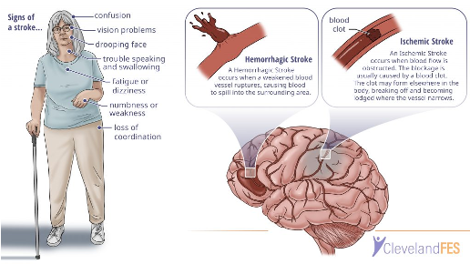
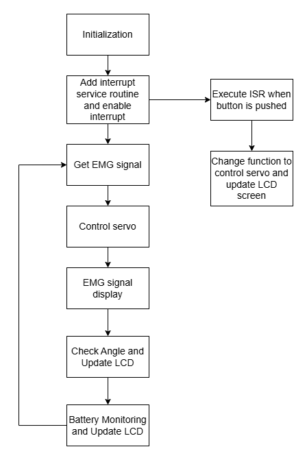
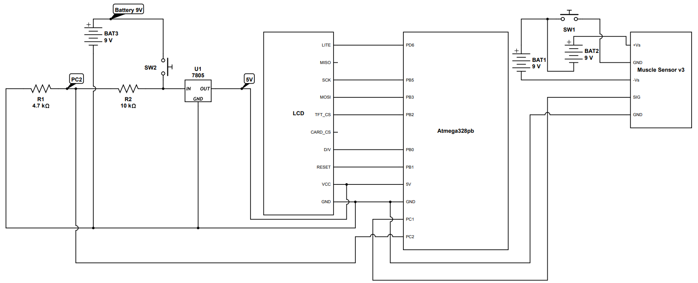
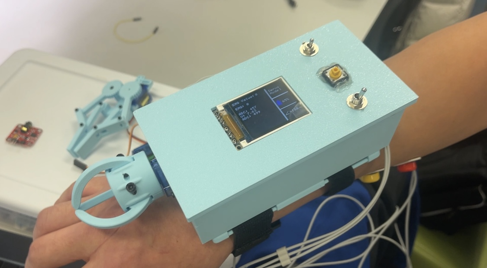

# Group 14 Smart Robot

    * Team Name: Smart Robot
    * Team Members: Zhongkun Xue and Toma Yasuda
    * Github Repository URL: https://github.com/BaymaxXzk/BaymaxXzk.github.io.git
    * Github Pages Website URL: https://baymaxxzk.github.io/
    * Description of hardware: EMG Sensor, 328PB, LCD, Serveo, Battery, Voltage Regulator, 3D printer

# Motivation

## 1. To help people with disabilities or injuries gain the ability to perform everyday tasks that require hand movements. 

## 2.To show the human-machine interaction like the Spider-Man

# Video demonstration

[Video](https://drive.google.com/file/d/1i9hbKQyfXkABlJKTv1TeEoS8o1czEdYp/view?usp=sharing)

# GIF demonstration

## Gripper part

## Spider shooter

# Images demonstration

### firmware_diagram

### Circuit

### Project

# SRS Validation

|      |Detail                                                                                                                            |Achievement  |
|------|----------------------------------------------------------------------------------------------------------------------------------| ------|
|SRS 1  |The software shall detect EMG signals between 0 and 1024 by ADC, filter noise under, and classify signal strength                |Yes      |
|SRS 2  |Decision-making algorithms shall open or close the claw within 0.5 seconds of detecting an EMG signal based on EMG signal thresholds, which is 200       |Yes      |
|SRS 3  |The system shall include fail-safe controls to prevent accidental or unsafe activation of the claw                                 |No      |
|SRS 4  |The system shall include the battery health calculation by ADC to show the percentage of the current battery                      |Yes      |
|SRS 5  |The software will output the PWM to control the servo degree       |Yes      |
|SRS 6  |The software shall include the ISR to handle the interrupt by the button, ensuring a response time of less than 1 seconds          |Yes      |
|SRS 7  | The software shall provide a user interface to display the real-time data, including EMG signal, battery health, and claw angle updating every 500 millisecond|Yes      |
|SRS 8  |The software shall communicate with the LCD display using SPI protocol to send data       |Yes      |

SRS 1: The software detects EMG signals between 0 and 1024 by ADC, filters noise under, and classifies signal strength. This requirement was tested by displaying the data corrected by the EMG signals on the serial terminal. The values corrected were between 0 and 1024 by ADC.  The data is showed in the video and the final_version.c file.

SRS 02: We measured the time between detecting an EMG signal and claw being opened and closed by displaying the time on the serial monitor. We tested 10 times and the maximum time is less than 0.5 seconds. 

|      |time(s)          |
|------|-----------------|
| 1  | 0.22|
| 2  | 0.35|
| 3  | 0.32|
| 4  | 0.19|
| 5  | 0.44|
| 6  | 0.34|
| 7  | 0.24|
| 8  | 0.47|
| 9  | 0.32|
| 10 | 0.33|

SRS 03: Not achieved because we did not include fail-safe controls to prevent accidental or unsafe activation of the claw. However, there is a button that can be used to stop the control of servo manually.

SRS 04: Achieved and the system includes battery health calculation by ADC to show the percentage of the current battery on the LCD screen. We tested this requirement by showing battery percentage on the screen and compared it with the measured value by the multimeter. The image of the LCD screen is shown in the video and the images part.

SRS 05: Achieved and the software outputs the PWM to control the servo degree. The servo can move the claw based on the input of the EMG signal. The code of final_version.c is showing the work and the video shows that the servo is controlled by the PWM.

SRS 06: We measured the response time to handle the interrupt by the button by printing on the serial. We tested 10 times and data is shown below.

|      |time(s)          |
|------|-----------------|
| 1  | 0.34|
| 2  | 0.54|
| 3  | 0.43|
| 4  | 0.41|
| 5  | 0.44|
| 6  | 0.56|
| 7  | 0.89|
| 8  | 0.54|
| 9  | 0.50|
| 10 | 0.67|

SRS 07: The time to update the LCD screen was measured and displayed on the serial monitor. We can check it from the video.

SRS 08: Achieved and the LCD screen displays the data including EMG signal, battery health, and claw angle. The image of the LCD screen displaying the data from the images part.

# HRS Validation

|      |Detail                                                                                                                            |Achievement  |
|------|----------------------------------------------------------------------------------------------------------------------------------| ------|
|HRS 1  |Project shall be based on ATmega328PB microcontroller operating at 16MHz           |Yes      |
|HRS 2  |EMG sensors (Myoware Muscle Sensor or equivalent) shall be used for muscle activity detection. The sensor shall detect muscle electrical activity in the range of 0-5V    |Yes      |
|HRS 3  |A 1.8" Color TFT LCD (ST7735R controller) shall be used for user interface                             |Yes      |
|HRS 4  |System shall include a servo motor with minimum 180-degree rotation capability for mechanical actuation controlled by PWM                    |Yes      |
|HRS 5  |Power supply shall be provided by a portable battery pack capable of supplying 5V DC or convert to 5V     |Yes      |

HRS 01:

Achieved. ATmega328PB microcontroller operating at 16MHz is used for this project. The proof is in the code which is final_version.c file.

HRS 02:
Myoware Muscle Sensor is used, the connection is good. The circuit image shows the voltage range and the funciton of the sensor in video shows it works well.

HRS 03:
Achieved. A 1.8" Color TFT LCD (ST7735R controller) to display data for users. The proof is in our video.

HRS 04:
Achieved. A servo motor with 180-degree rotation capability for mechanical actuation controlled by PWM is used for our project. Here is the link for the datasheet of the servo.

[datasheet_SG90](http://www.ee.ic.ac.uk/pcheung/teaching/DE1_EE/stores/sg90_datasheet.pdf)

HRS 05:
A 9V battery is used for power supply and converted to 5 volts by using a voltage regulator. We measured the voltage supplied to the ATmega328PB by using a multimeter. We checked the voltage by using a multimeter and it was about 5 volts. Our circuit image can proof it.

# Conclusion

In this project, we were able to design a smart robot system that demonstrated key principles of embedded systems: real-time control, efficient power management, and robust sensor integration. With the use of advanced microcontrollers and carefully chosen components, we were able to find a balance between performance and functionality. The robot performed its designed tasks efficiently, showing our understanding of embedded software design, hardware interfacing, and system optimization.

# What Would You Have Done Differently?
Reflecting on the project, there are several aspects we would approach differently to further enhance the system:

### Hardware Optimization:

We would have chosen more modular and scalable hardware components to allow for easier integration and future upgrades.
Exploring alternative power sources or optimizing power consumption would have extended operational time.

### Improved Testing and Debugging:

Incorporating more systematic testing at every development stage would have reduced debugging time.
Adding diagnostic tools or logging mechanisms would have provided clearer insights into system behavior under different conditions.

### Algorithm Refinement:

Implementing more advanced control algorithms, such as predictive or adaptive controls, could have improved the robot's efficiency and responsiveness.
Exploring machine learning techniques could have added an element of autonomy and adaptability.
